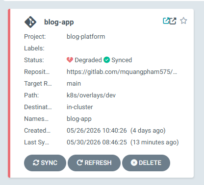

# BÁO CÁO KẾT QUẢ TRIỂN KHAI HỆ THỐNG DEVOPS & OBSERVABILITY

Báo cáo này tập trung phân tích chi tiết cấu trúc cấu hình, nguyên lý hoạt động và phân tích mã nguồn của hai phân hệ DevOps cốt lõi: **Hệ thống CI/CD & GitOps** và **Hệ thống Giám sát & Truy vết (Observability Stack)**.

---

## PHẦN 1: HỆ THỐNG TÍCH HỢP VÀ TRIỂN KHAI LIÊN TỤC (CI/CD & GITOPS)

### 1. Mục tiêu và Vai trò
*   **Tự động hóa hoàn toàn**: Loại bỏ các thao tác build, test và deploy thủ công, giảm thiểu sai sót do con người.
*   **Kiểm soát chất lượng và an ninh**: Đảm bảo toàn bộ mã nguồn trước khi đóng gói đều vượt qua kiểm thử đơn vị (Unit Test), quét lỗ hổng bảo mật container (Trivy), và phân tích chất lượng code (SonarCloud).
*   **Triển khai an toàn dạng GitOps**: GitLab Runner không can thiệp trực tiếp vào cụm K8s. Mọi thay đổi về trạng thái triển khai đều được khai báo qua Git (GitOps Git-centric) để ArgoCD tự động kéo về, đảm bảo mô hình Zero-Trust.

### 2. Sơ đồ luồng và Nguyên lý hoạt động

```
[Developer Push Code] 
        │
        ▼
[GitLab CI Pipeline]
  ├── 1. Validate (Kiểm tra cú pháp)
  ├── 2. Docker Build & Unit Test (Biên dịch, chạy JUnit và đóng gói image)
  ├── 3. Container Scan (Trivy quét lỗ hổng image)
  ├── 4. Static Analysis (SonarCloud đánh giá chất lượng mã nguồn)
  └── 5. Deploy GitOps (Cập nhật image tag bằng Kustomize)
        │
        ▼ (Git Commit & Push [skip ci])
[Git Repository (k8s/base/kustomization.yaml)] ◄─── [ArgoCD Sync] ───► [K3d Cluster]
```

#### Phân tích nguyên lý luồng hoạt động CI/CD & GitOps:

Quy trình tích hợp và triển khai liên tục được tự động hóa hoàn toàn qua hai giai đoạn chính:

1.  **Giai đoạn Tích hợp liên tục (Continuous Integration - GitLab CI)**:
    *   **Kích hoạt**: Lập trình viên đẩy mã nguồn mới lên nhánh `main` của kho chứa GitLab. GitLab Runner phát hiện sự kiện và khởi chạy quy trình pipeline.
    *   **Validate**: Kiểm tra tính hợp lệ cú pháp và cấu trúc của tệp cấu hình pipeline [.gitlab-ci.yml](file:///c:/Project/devops-project/.gitlab-ci.yml).
    *   **Docker Build & Unit Test**: Chạy thử nghiệm các ca kiểm thử JUnit (JUnit Test Cases). Nếu toàn bộ test case vượt qua thành công, mã nguồn mới được đóng gói thành Docker image sử dụng kỹ thuật cache layer giúp tối ưu hóa thời gian build.
    *   **Container Scan (Trivy)**: Quét bảo mật tĩnh image vừa đóng gói. Hệ thống chỉ cho phép đi tiếp nếu mức độ lỗ hổng an ninh nằm dưới ngưỡng cho phép (0 lỗi `HIGH` và `CRITICAL`).
    *   **Static Analysis (SonarCloud)**: Tiến hành quét phân tích tĩnh chất lượng mã nguồn. Dự án bắt buộc phải đạt tiêu chuẩn Quality Gate của SonarCloud (đã cấu hình chốt chặn cứng) mới được quyền đi tiếp tới giai đoạn triển khai.

2.  **Giai đoạn Triển khai liên tục (Continuous Deployment - GitOps & ArgoCD)**:
    *   **Deploy GitOps**: Runner cài đặt công cụ Kustomize, cập nhật tag image mới của dịch vụ vào tệp cấu hình manifest [kustomization.yaml](file:///c:/Project/devops-project/k8s/base/kustomization.yaml). 
    *   **Kiểm thử Manifest**: Chạy kiểm tra lỗi cú pháp tệp manifest bằng `kustomize build`. Nếu hợp lệ, hệ thống commit và đẩy ngược lại kho lưu trữ Git kèm theo tag `[skip ci]` để tránh gây lặp vô hạn pipeline.
    *   **ArgoCD Sync**: ArgoCD hoạt động bên trong cụm K3d liên tục lắng nghe thay đổi từ Git repository. Khi phát hiện manifest ở Git khác biệt với trạng thái thực tế của cụm, ArgoCD tự động kéo cấu hình mới về và thực hiện đồng bộ hóa (Sync), cập nhật các Pod chạy trên cụm mà không cần cấp quyền truy cập Kubernetes trực tiếp cho GitLab CI (mô hình Pull-based GitOps bảo mật).


---

### 3. Phân tích mã nguồn và Chi tiết cấu hình

#### A. Cấu hình quy trình CI tổng quát
Quy trình pipeline được định nghĩa trong cấu hình GitLab CI chia thành 5 stages tuần tự:
```yaml
stages:
  - validate
  - docker-build
  - scan
  - static-analysis
  - deploy
```

> **Hình 1.1: Giao diện GitLab CI Pipeline**
> 
> *Mô tả hình ảnh: Giao diện đồ thị pipeline chạy thành công trên GitLab CI với đầy đủ các job được phân luồng song song (`validate-pipeline`, các job build, scan, phân tích tĩnh và deploy của 5 microservices backend và 1 frontend).*

#### B. Phân tích Dockerfile tích hợp JUnit Test
Để ngăn ngừa việc đóng gói một container chứa code lỗi, quá trình chạy thử nghiệm JUnit Test được nhúng trực tiếp trong Build Stage của Dockerfile:
```dockerfile
FROM public.ecr.aws/docker/library/maven:3.9.6-eclipse-temurin-17 AS build
WORKDIR /app
COPY pom.xml .
RUN --mount=type=cache,target=/root/.m2 mvn dependency:go-offline
COPY src ./src
RUN --mount=type=cache,target=/root/.m2 mvn clean package
```
*   **Tính năng Cache (`--mount=type=cache`)**: Sử dụng tính năng cache của Docker BuildKit giúp giữ lại các thư viện `.m2` đã tải về, đẩy nhanh tốc độ build ở những lần sau.
*   **Đóng gói & Chạy Test (`mvn clean package`)**: Lệnh này tự động kích hoạt tiến trình biên dịch mã nguồn và chạy toàn bộ các JUnit test case. Nếu có bất kỳ test case nào thất bại (fail), Docker build sẽ trả về lỗi và dừng ngay lập tức, ngăn chặn việc sinh ra image lỗi.

> **Hình 1.2: Log chạy JUnit Test**
> 
> *Mô tả hình ảnh: Tiến trình chạy JUnit test tự động (`FileServiceApplicationTests`) vượt qua thành công với kết quả `Tests run: 1, Failures: 0, Errors: 0, Skipped: 0` và thông báo `BUILD SUCCESS` từ Maven clean package stage.*

#### C. Phân tích Job quét an ninh Container (`Trivy`)
Cấu hình mẫu job quét Trivy được kế thừa làm khung cho toàn bộ các microservices:
```yaml
.scan_template:
  stage: scan
  image:
    name: public.ecr.aws/aquasecurity/trivy:0.69.3
    entrypoint: [""]
  before_script:
    - export TRIVY_USERNAME=$CI_REGISTRY_USER
    - export TRIVY_PASSWORD=$CI_REGISTRY_PASSWORD
  script:
    - trivy image --cache-backend memory --cache-dir $TRIVY_CACHE_DIR --skip-db-update --skip-java-db-update --scanners vuln --exit-code 1 --severity HIGH,CRITICAL --no-progress $CI_REGISTRY_IMAGE/$IMAGE_NAME:$CI_COMMIT_SHORT_SHA
```
*   **Chặn pipeline khi có lỗi (`--exit-code 1`)**: Chỉ thị cho Trivy trả về mã lỗi `1` (thất bại) nếu phát hiện lỗ hổng. Điều này giúp dừng pipeline CI lập tức khi phát hiện lỗi bảo mật nghiêm trọng.
*   **Độ nghiêm trọng (`--severity HIGH,CRITICAL`)**: Chỉ quét và lọc các lỗ hổng nguy hiểm ở mức Cao (High) và Nghiêm trọng (Critical) để tránh làm nghẽn pipeline bởi các cảnh báo mức thấp.
*   **Tránh tải lại DB (`--skip-db-update`)**: Kết hợp với job `prepare-trivy-db` để tải sẵn database lỗ hổng về thư mục cache dùng chung, tránh việc mỗi job scan đều tải lại DB dẫn đến bị chặn IP bởi nhà cung cấp.

> **Hình 1.3: Console log job quét Trivy**
> 
> *Mô tả hình ảnh: Bảng tổng hợp kết quả quét an ninh container (Report Summary) của Trivy đối với hệ điều hành Alpine và ứng dụng Java Package (app.jar) hiển thị 0 lỗi bảo mật HIGH và CRITICAL.*

#### D. Phân tích tĩnh chất lượng mã nguồn (SonarCloud)
Cấu hình job phân tích tĩnh giúp đảm bảo mã nguồn tuân thủ các quy tắc chất lượng:
```yaml
.sonar_template:
  stage: static-analysis
  image:
    name: sonarsource/sonar-scanner-cli:latest
    entrypoint: [""]
  variables:
    SONAR_USER_HOME: "${CI_PROJECT_DIR}/.sonar"
    GIT_DEPTH: "0"
  cache:
    key: "sonar-shared-cache"
    paths:
      - .sonar/cache
  script:
    - sonar-scanner -Dsonar.projectKey=${SONAR_ORGANIZATION}_${IMAGE_NAME} -Dsonar.projectName=${IMAGE_NAME} -Dsonar.sources=${SERVICE_DIR} -Dsonar.host.url=${SONAR_HOST_URL} -Dsonar.token=${SONAR_TOKEN} -Dsonar.organization=${SONAR_ORGANIZATION} -Dsonar.java.binaries=. -Dsonar.exclusions=**/node_modules/**,**/dist/**,**/build/**,**/.next/**,**/*.min.js -Dsonar.javascript.node.maxspace=1400 -Dsonar.javascript.createTSProgramForOrphanFiles=false -Dsonar.coverage.exclusions=**/*
  allow_failure: false
```
*   **Chốt chặn chất lượng (Enforce Quality Gate)**: Việc cấu hình `allow_failure: false` buộc dự án phải vượt qua các tiêu chí chất lượng nghiêm ngặt của SonarCloud để có thể triển khai tiếp, nâng cao tính an toàn DevSecOps.
*   **Tối ưu hóa phạm vi phân tích và Tốc độ quét (Từ 9 phút xuống 1 phút 30 giây)**:
    *   **Loại trừ coverage (`-Dsonar.coverage.exclusions=**/*`)**: Loại bỏ việc phân tích độ phủ mã nguồn (Unit Test Coverage) để tránh sensor của SonarCloud tốn nhiều thời gian đọc tệp XML của JUnit/JaCoCo.
    *   **Loại trừ thư mục nặng (`-Dsonar.exclusions=**/node_modules/**,**/dist/**...`)**: Ngăn chặn SonarCloud quét hàng vạn file thư viện JavaScript trong thư mục dependencies của frontend.
    *   **Bỏ qua tệp mồ côi (`-Dsonar.javascript.createTSProgramForOrphanFiles=false`)**: Giảm tải việc khởi tạo trình biên dịch TypeScript không cần thiết.
    *   *Hiệu quả thực tế*: Việc cấu hình các bộ lọc loại trừ thông minh này giúp rút ngắn thời gian quét của job phân tích tĩnh từ **9 phút** xuống chỉ còn **1 phút 30 giây**, đảm bảo tốc độ phản hồi nhanh cho pipeline.

> **Hình 1.4: Dashboard SonarCloud**
> 
> *Mô tả hình ảnh: Bảng điều khiển (Dashboard) của SonarQube Cloud quản lý 5 dự án backend microservices đều đạt trạng thái Passed Quality Gate cùng đánh giá điểm Grade A tuyệt đối cho các mục Security và Reliability.*

#### E. Phân tích Job Deploy GitOps (`.deploy_template`)
Đây là bộ phận cốt lõi cập nhật manifest tự động và giải quyết các xung đột ghi đồng thời:
```yaml
.deploy_template:
  stage: deploy
  image:
    name: alpine/git:latest
    entrypoint: [""]
  resource_group: production-deploy
  before_script:
    - git config --global user.name "Gitlab CI"
    - git config --global user.email "ci@gitlab.com"
    - git config --global http.postBuffer 524288000
    - git remote set-url origin https://oauth2:${GIT_PUSH_TOKEN}@${CI_SERVER_HOST}/${CI_PROJECT_PATH}.git
    - apk add --no-cache curl
    - curl -sLo /tmp/kustomize.tar.gz "https://github.com/kubernetes-sigs/kustomize/releases/download/kustomize%2Fv5.4.3/kustomize_v5.4.3_linux_amd64.tar.gz"
    - tar -xzf /tmp/kustomize.tar.gz -C /usr/local/bin/
    - chmod +x /usr/local/bin/kustomize
  script:
    - |
      PUSH_SUCCESS=false
      for i in $(seq 1 10); do
        git fetch origin main
        git checkout -f origin/main
        cd k8s/base
        kustomize edit set image $CI_REGISTRY_IMAGE/$SERVICE_NAME=$CI_REGISTRY_IMAGE/$SERVICE_NAME:$CI_COMMIT_SHORT_SHA
        if ! kustomize build . > /dev/null; then
          echo "Error: Kustomize build validation failed."
          exit 1
        fi
        cd ../..
        git add k8s/base/kustomization.yaml
        if git diff --cached --quiet; then
          echo "No kustomization changes to commit, skipping deploy push."
          PUSH_SUCCESS=true
          break
        fi
        git commit -m "ci: update $SERVICE_NAME image tag to $CI_COMMIT_SHORT_SHA [skip ci]"
        if git push origin HEAD:main; then
          echo "Successfully pushed update for $SERVICE_NAME"
          PUSH_SUCCESS=true
          break
        fi
        echo "Push attempt $i failed, retrying..."
        sleep $((RANDOM % 5 + 2))
      done
```
*   **Khóa ghi đồng bộ (`resource_group: production-deploy`)**: Tính năng của GitLab khóa đồng bộ, đảm bảo tại một thời điểm chỉ có duy nhất 1 job deploy chạy trên runner để giảm thiểu xung đột.
*   **Kiểm tra cú pháp manifest (`kustomize build .`)**: Thực hiện biên dịch thử manifest ngay sau khi ghi đè tag image. Nếu phát hiện cấu trúc tệp manifest bị lỗi, job sẽ lập tức dừng và thoát với mã lỗi `1`, ngăn chặn việc đẩy manifest lỗi lên Git repository chính.
*   **Vòng lặp `for i in $(seq 1 10)` (Race Condition Handling)**: Do 5 microservices chạy pipeline song song, chúng sẽ đồng thời cố gắng sửa đổi tệp `kustomization.yaml`. Vòng lặp này giúp runner liên tục fetch bản mới nhất (`git fetch`), ghi đè cục bộ tag image mới (`kustomize edit set image`), commit và thử đẩy lên lại. Nếu đẩy thất bại (do conflict), nó sẽ `sleep` ngẫu nhiên từ 2-6 giây và thử lại tối đa 10 lần.
*   **Ngăn chặn lặp vô hạn (`[skip ci]`)**: Thêm vào commit message để báo cho GitLab CI không kích hoạt pipeline mới từ commit cập nhật cấu hình này, tránh thảm họa vòng lặp pipeline vô hạn.

> **Hình 1.5: Giao diện ArgoCD đồng bộ**
> 
> *Mô tả hình ảnh: Giao diện quản trị ArgoCD hiển thị bốn ứng dụng (`blog-app`, `monitoring`, `postgres-db`, `seaweedfs`) ở trạng thái Synced và Healthy, đồng bộ tự động cấu hình.*

---

#### F. Cấu hình Triển khai Lai (Hybrid GitOps: Kustomize & Helm)
Để cân bằng giữa tốc độ tích hợp liên tục và tính bền vững của hạ tầng cơ sở dữ liệu/lưu trữ, hệ thống áp dụng mô hình triển khai lai:
*   **Kustomize cho các Microservices tự phát triển**: Giúp GitLab CI chạy cực nhanh thông qua các lệnh thay đổi tag image trực tiếp trên tệp `kustomization.yaml` bằng `kustomize edit set image`, tránh việc phải duy trì các Helm chart tự viết phức tạp cho từng microservice.
*   **Official Helm Charts cho Cơ sở dữ liệu và Storage**: Tích hợp các Helm Chart chính thức từ cộng đồng do Argo CD quản lý để triển khai PostgreSQL (Bitnami) và SeaweedFS. Điều này giúp loại bỏ việc tự duy trì các manifest YAML thủ công phức tạp và dễ lỗi cho các phần hạ tầng dùng chung.

##### Chi tiết cấu hình PostgreSQL Helm Application (`argocd/postgres.yaml`):
```yaml
apiVersion: argoproj.io/v1alpha1
kind: Application
metadata:
  name: postgres-db
  namespace: argocd
spec:
  project: blog-platform
  source:
    repoURL: https://charts.bitnami.com/bitnami
    chart: postgresql
    targetRevision: 15.2.5
    helm:
      values: |
        fullnameOverride: postgres
        image:
          tag: latest
        auth:
          username: devops_admin
          database: postgres
          existingSecret: db-credentials
          secretKeys:
            userPasswordKey: POSTGRES_PASSWORD
            adminPasswordKey: POSTGRES_PASSWORD
```

##### Hợp nhất Cơ sở dữ liệu & Giải quyết phân quyền schema trong PostgreSQL 15+:
1.  **Hợp nhất 5 Pod DB thành 1 single cluster**: Thay vì chạy 5 pod PostgreSQL độc lập gây lãng phí lớn tài nguyên RAM/CPU trên cụm, hệ thống hợp nhất thành một thực thể `postgres` duy nhất.
2.  **Khởi tạo 5 database riêng biệt**: Sử dụng cấu hình `primary.initdb.scripts` để chạy một đoạn script khởi tạo tự động khi container boot lần đầu tiên.
3.  **Bảo mật quyền truy cập (`OWNER devops_admin`)**: Do PostgreSQL 15+ thắt chặt quyền truy cập mặc định trên schema `public`, việc tạo database bằng superuser `postgres` rồi phân quyền qua `GRANT` sẽ khiến các microservices gặp lỗi `permission denied for schema public` khi tự khởi tạo bảng bằng JPA/Hibernate. Giải pháp triệt để là chạy tập lệnh khởi tạo dưới tư cách superuser và gán quyền sở hữu trực tiếp cho người dùng kết nối (`OWNER devops_admin`):
    ```sql
    CREATE DATABASE user_service_db OWNER devops_admin;
    CREATE DATABASE blog_service_db OWNER devops_admin;
    CREATE DATABASE file_service_db OWNER devops_admin;
    CREATE DATABASE customer_service_db OWNER devops_admin;
    CREATE DATABASE interaction_service_db OWNER devops_admin;
    ```
4.  **Cập nhật kết nối**: Toàn bộ các microservices được cấu hình trỏ url kết nối datasource về máy chủ chung: `jdbc:postgresql://postgres:5432/<db_name>`.

---

### 4. Chủ ý thiết kế và Tối ưu hóa hệ thống (CI/CD)
*   **Incremental Pipeline (Rules:Changes)**:
    Tối ưu hóa tài nguyên phần cứng bằng cách chỉ build, quét và deploy dịch vụ có mã nguồn thay đổi. Chúng tôi thiết lập cấu hình kiểm soát thay đổi:
    ```yaml
    .user-service-rules:
      rules:
        - if: $FORCE_ALL == "true"
        - if: $CI_COMMIT_BRANCH == "main"
          changes:
            - backend/user-service/**/*
            - .gitlab-ci.yml
    ```
    Nếu commit chỉ thay đổi code ở một dịch vụ (ví dụ: `blog-service`), các job liên quan đến các dịch vụ khác sẽ tự động chuyển sang trạng thái bỏ qua (skipped), giúp giảm tổng số lượng job thực thi từ 25 xuống còn 6 jobs. Điều này tiết kiệm hơn 75% tài nguyên tính toán của máy chủ build và rút ngắn tổng thời gian hoàn thành pipeline từ 11 phút 54 giây xuống còn 3 phút 4 giây.

> **Hình 1.6: Minh chứng cơ chế Incremental Pipeline (Chạy chọn lọc)**
> 
> *Mô tả hình ảnh: Đồ thị pipeline chỉ chạy 6 job phục vụ duy nhất dịch vụ `blog-service` (đáp ứng đúng theo commit thay đổi chỉ xảy ra trong blog-service), các microservice khác được bỏ qua hoàn toàn.*

---
---

## PHẦN 2: HỆ THỐNG GIÁM SÁT VÀ CẢNH BÁO (MONITORING & OBSERVABILITY)

### 1. Mục tiêu và Vai trò
*   **Đo lường sức khỏe hệ thống (Metrics)**: Thu thập thông tin tài nguyên phần cứng (CPU, RAM) và trạng thái ứng dụng Java (Memory heap, HTTP requests, GC pauses).
*   **Tập trung hóa dữ liệu nhật ký (Logs)**: Thu thập nhật ký container tập trung để loại bỏ việc truy cập trực tiếp bằng lệnh `kubectl logs`.
*   **Truy vết phân tán (Tracing)**: Theo dõi vết request đi xuyên suốt qua các tầng microservices để định vị điểm nghẽn hiệu năng (bottleneck).
*   **Cảnh báo chủ động (Alerting)**: Tự động phát hiện sự cố sập dịch vụ, CrashLoop, quá tải tài nguyên và gửi thư cảnh báo tức thời về Gmail SMTP.

### 2. Sơ đồ luồng và Nguyên lý hoạt động

> **Hình 2.0: Mô hình kiến trúc ba trụ cột Observability (Metrics, Logs, Traces)**
> 
> *Mô tả hình ảnh: Sơ đồ phân hệ giám sát chia thành ba trụ cột dữ liệu độc lập (Metrics, Logs, Traces) được hội tụ về và hiển thị trực quan hóa tập trung trên giao diện Grafana.*

#### Phân tích nguyên lý luồng dữ liệu giám sát:

Hệ thống Observability được thiết kế dựa trên mô hình ba trụ cột cốt lõi nhằm giám sát toàn diện ứng dụng Java Microservices:

1.  **Phân luồng Thu thập Chỉ số (Metrics - Prometheus)**:
    *   **Nguyên lý hoạt động**: Sử dụng mô hình **Pull-based**. Prometheus định kỳ gửi HTTP request đến các endpoint `/actuator/prometheus` của từng microservice để chủ động kéo (scrape) các chỉ số hiệu năng (tài nguyên CPU/RAM, trạng thái luồng xử lý JVM, số lượng request và tỷ lệ lỗi).
    *   **Vai trò**: Cung cấp bức tranh tổng thể về sức khỏe phần cứng, hiệu năng ứng dụng theo thời gian thực và làm nguồn dữ liệu kích hoạt cảnh báo cho Alertmanager.

2.  **Phân luồng Thu thập Nhật ký (Logs - Promtail & Loki)**:
    *   **Nguyên lý hoạt động**: Promtail được triển khai dưới dạng **DaemonSet** trên mỗi node của Kubernetes để đọc trực tiếp các file log (stdout/stderr) của container từ ổ đĩa máy chủ. Promtail sau đó đẩy (push) dòng dữ liệu log này về máy chủ **Loki** theo cơ chế streaming.
    *   **Vai trò**: Loki lập chỉ mục (index) log dựa trên metadata của Kubernetes (như namespace, pod name, container name) thay vì index toàn bộ nội dung text, giúp giảm thiểu dung lượng lưu trữ tối đa và tăng tốc truy vấn LogQL từ Grafana.

3.  **Phân luồng Thu thập Dấu vết (Traces - OpenTelemetry & Jaeger)**:
    *   **Nguyên lý hoạt động**: Java Agent của **OpenTelemetry** tự động chèn mã bytecode để bắt các sự kiện giao dịch HTTP. Agent xuất (export) dữ liệu trace (các spans) qua giao thức OTLP gRPC đến Collector, sau đó lưu trữ tại **Jaeger**.
    *   **Vai trò**: Giúp theo dõi hành trình xuyên suốt của một request đi qua các tầng microservices khác nhau. Dữ liệu trace cung cấp cấu trúc dạng cây để dễ dàng xác định chính xác dịch vụ nào đang gây ra độ trễ cao (latency) hoặc lỗi nghiệp vụ.

4.  **Hội tụ Trực quan hóa (Grafana)**:
    *   Grafana kết nối với cả ba nguồn dữ liệu trên làm Data Sources. Nhờ đó, người vận hành có thể liên kết (correlate) chéo dữ liệu: khi có cảnh báo lỗi từ Prometheus (Metrics), có thể lập tức chuyển hướng xem log tương ứng (Loki) và truy vết request bị lỗi (Jaeger) ngay trên một màn hình duy nhất.

---

---

### 3. Phân tích mã nguồn và Chi tiết cấu hình

#### A. Cấu hình Service Discovery của Prometheus (`prometheus.yml`)
Prometheus tự động dò tìm các endpoint của ứng dụng microservice thông qua các thông tin khai báo (Kubernetes Endpoints API):
```yaml
  - job_name: 'kubernetes-service-endpoints'
    kubernetes_sd_configs:
      - role: endpoints
        namespaces:
          names:
            - blog-app
    relabel_configs:
      - source_labels: [__meta_kubernetes_service_name]
        action: keep
        regex: .*-service
      - target_label: __metrics_path__
        replacement: /actuator/prometheus
```
*   **`role: endpoints`**: Chỉ thị cho Prometheus truy vấn danh sách tất cả IP và port của các endpoint trong cụm.
*   **`action: keep` & `regex: .*-service`**: Bộ lọc bảo mật chỉ thu thập dữ liệu từ các dịch vụ microservice kết thúc bằng hậu tố `-service` (loại bỏ các database, cache, storage không cần thiết).
*   **`replacement: /actuator/prometheus`**: Tự động chuyển hướng đường dẫn thu thập metrics về cổng Spring Boot Actuator Prometheus.

> **Hình 2.1: Giao diện Prometheus Target Discovery**
> 
> *Mô tả hình ảnh: Giao diện danh sách Targets của Prometheus cho thấy toàn bộ 5/5 endpoints ứng dụng microservices trong namespace `blog-app` và chính nó (prometheus 1/1) đều đang ở trạng thái hoạt động UP màu xanh lá.*

#### B. Cấu hình Dashboard và Provisioning trên Grafana (`grafana.yaml`)
Grafana tự động load cấu hình dữ liệu và giao diện dashboard ngay khi deploy thông qua ConfigMap:
```yaml
apiVersion: v1
kind: ConfigMap
metadata:
  name: grafana-provisioning
  namespace: monitoring
data:
  dashboards.yaml: |
    apiVersion: 1
    providers:
      - name: 'Spring Boot Services'
        orgId: 1
        folder: ''
        type: file
        disableDeletion: false
        editable: true
        options:
          path: /var/lib/grafana/dashboards
  datasources.yaml: |
    apiVersion: 1
    datasources:
      - name: Prometheus
        type: prometheus
        access: proxy
        url: http://prometheus.monitoring.svc:9090
        isDefault: true
      - name: Loki
        type: loki
        url: http://loki:3100
      - name: Jaeger
        type: jaeger
        url: http://jaeger:16686
```

> **Hình 2.2: Giao diện giám sát Grafana Dashboard**
> 
> *Mô tả hình ảnh: Dashboard giám sát Spring Boot Services Monitor trên Grafana hiển thị trực quan các biểu đồ hiệu năng phần cứng CPU, bộ nhớ JVM Heap, non-Heap memory, tần suất dọn rác GC và biểu đồ HTTP traffic, latency.*

#### C. Cơ chế log tập trung Loki & Promtail (`loki-stack.yaml`)
Loki nhận logs stream đẩy về từ Promtail. Promtail được triển khai dạng DaemonSet chạy trên toàn bộ các node để đọc trực tiếp file log container:
```yaml
apiVersion: v1
kind: ConfigMap
metadata:
  name: promtail-config
  namespace: monitoring
data:
  promtail.yaml: |
    server:
      http_listen_port: 9080
    positions:
      filename: /tmp/positions.yaml
    clients:
      - url: http://loki:3100/loki/api/v1/push
    scrape_configs:
    - job_name: kubernetes-pods
      kubernetes_sd_configs:
      - role: pod
      pipeline_stages:
      - docker: {}
      relabel_configs:
      - source_labels: [__meta_kubernetes_pod_uid, __meta_kubernetes_pod_container_name]
        separator: /
        action: replace
        replacement: /var/log/pods/*$1/*.log
        target_label: __path__
```

> **Hình 2.3: Nhật ký Log tập trung trên Grafana Loki**
> 
> *Mô tả hình ảnh: Trình Explore trên Grafana sử dụng nguồn dữ liệu Loki để lọc log của container `blog-service` theo thời gian thực, có biểu đồ mật độ log và chi tiết log ứng dụng Spring Boot ở dưới.*

#### D. Phân tích Cơ chế chèn tự động OpenTelemetry Java Agent
Để theo dõi vết request mà không cần sửa đổi mã nguồn Java, chúng tôi triển khai chèn Agent bằng cơ chế Init Container của Kubernetes:
```yaml
      initContainers:
        - name: otel-agent
          image: ghcr.io/open-telemetry/opentelemetry-operator/autoinstrumentation-java:1.32.0
          command: ["cp", "/javaagent.jar", "/otel/opentelemetry-javaagent.jar"]
          volumeMounts:
            - name: otel-agent-volume
              mountPath: /otel
      containers:
        - name: blog-service
          ...
          env:
            - name: JAVA_TOOL_OPTIONS
              value: "-javaagent:/otel/opentelemetry-javaagent.jar"
            - name: OTEL_SERVICE_NAME
              value: "blog-service"
            - name: OTEL_EXPORTER_OTLP_ENDPOINT
              value: "http://otel-collector.monitoring.svc.cluster.local:4317"
```
*   **`initContainers`**: Container này chạy và kết thúc trước khi ứng dụng khởi động. Nó sao chép tệp `opentelemetry-javaagent.jar` từ image của OpenTelemetry sang ổ đĩa chia sẻ nội bộ Pod (`otel-agent-volume`).
*   **`JAVA_TOOL_OPTIONS`**: Khi container ứng dụng JVM chính khởi chạy, nó tự động nạp Java Agent qua tham số `-javaagent`. Agent này sẽ giám sát các luồng HTTP của Tomcat và tự động gửi dấu vết (traces) về OpenTelemetry Collector ở cổng `4317`.

> **Hình 2.4: Bản đồ truy vết Jaeger UI (Gantt Chart)**
> 
> *Mô tả hình ảnh: Sơ đồ Gantt trên Jaeger UI của vết request GET `/api/blogs/pinned` thuộc dịch vụ `blog-service` phân rã thời gian xử lý thành 6 spans chi tiết, minh chứng thời gian truy vấn SQL trực tiếp trong cơ sở dữ liệu `blog_service_db`.*


#### E. Phân tích Cấu hình Định tuyến Cảnh báo Email (`alertmanager.yml`)
Cấu hình định tuyến và thông số SMTP cho Alertmanager được khai báo độc lập:
```yaml
receivers:
- name: 'email-alerts'
  email_configs:
  - to: 'quang8c6@gmail.com'
    from: 'quang8c6@gmail.com'
    smarthost: 'smtp.gmail.com:587'
    auth_username: 'quang8c6@gmail.com'
    auth_password_file: '/etc/alertmanager-secrets/smtp_password'
    require_tls: true
```
*   **`smarthost: smtp.gmail.com:587`**: Định tuyến cảnh báo qua máy chủ SMTP của Gmail sử dụng TLS mã hóa để bảo mật đường truyền.
*   **`auth_password_file`**: Đường dẫn tới tệp chứa mật khẩu ứng dụng Gmail. Mật khẩu thực tế được lưu trữ an toàn trong Kubernetes Secret (`alertmanager-secrets`) và được mount vào container dưới dạng tệp tin, giúp loại bỏ hoàn toàn mật khẩu văn bản thô khỏi kho lưu trữ Git và các tệp tin cấu hình tĩnh.

> **Hình 2.5: Email cảnh báo thực tế**
> 
> *Mô tả hình ảnh: Nội dung email cảnh báo tự động gửi về Gmail từ Alertmanager hiển thị thông tin cảnh báo `ServiceDown` mức độ `critical` của dịch vụ giả lập `test-trigger-service`.*

> **Hình 2.6: Trạng thái Alerting Firing trên Prometheus**
> 
> *Mô tả hình ảnh: Giao diện quản lý Alerts của Prometheus hiển thị cảnh báo luật `ServiceDown` đã chuyển sang màu đỏ rực ở trạng thái kích hoạt (**FIRING**).*

#### F. Phân tích Kustomize ConfigMap Hash Generator
Cấu hình tự động reload các ứng dụng (Prometheus, Alertmanager) khi thay đổi cấu hình tệp cấu hình YML bằng cách đính kèm mã hash động vào tên ConfigMap:
```yaml
configMapGenerator:
  - name: prometheus-config
    files:
      - prometheus.yml
  - name: alertmanager-config
    files:
      - alertmanager.yml
```
*   **`configMapGenerator`**: Kustomize sẽ tạo các ConfigMap từ file vật lý `prometheus.yml` và `alertmanager.yml`. Điểm đặc biệt là tên ConfigMap sinh ra sẽ được tự động đính kèm mã băm nội dung ở đuôi (ví dụ: `prometheus-config-h5f7hgd6`). Khi file cấu hình thay đổi, mã băm thay đổi ➔ Tên ConfigMap thay đổi ➔ Kubernetes Deployment phát hiện ra sự thay đổi Spec và lập tức kích hoạt Rolling Update tự động để cập nhật cấu hình mà không cần khởi động lại thủ công.

---

### 4. Chủ ý thiết kế và Tối ưu hóa hệ thống (Monitoring)
*   **Zero-Code Instrumentation (Tác nhân không can thiệp code)**: Việc sử dụng OpenTelemetry Agent ở tầng JVM giúp dự án có khả năng truy vết phân tán tức thì cho toàn bộ các microservices (User, Blog, Interaction, Customer, File) mà không cần lập trình viên chỉnh sửa hay import thêm thư viện tracing vào mã nguồn Java, duy trì sự độc lập của dự án phát triển.
*   **Log Centralization (Thu thập không dùng ổ đĩa)**: Promtail chạy dưới dạng DaemonSet thu thập trực tiếp log xuất ra console (stdout/stderr) của container từ đường dẫn hệ thống của Kubernetes. Điều này tránh việc container ghi log trực tiếp vào ổ đĩa ảo gây tràn tài nguyên ổ đĩa cụm K8s.
