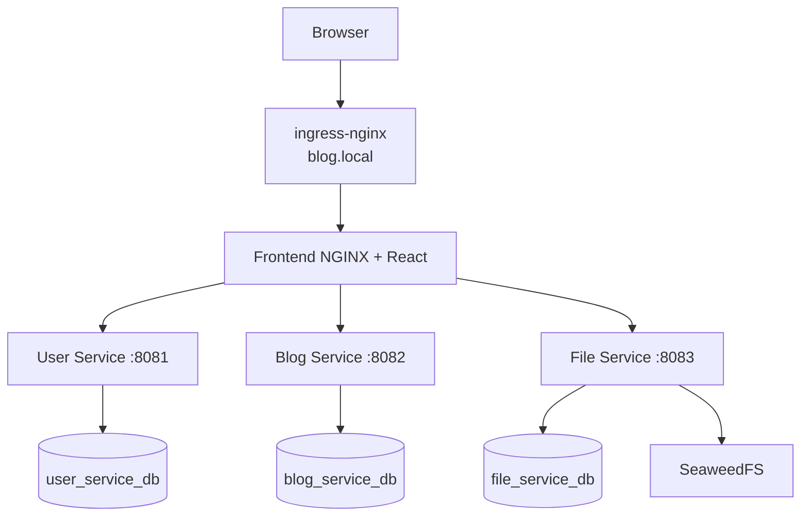

# Blog Platform

Microservices-based blog application for NT548.Q21 DevOps coursework.

## Overview

| Component      | Technology                      | Purpose                                       |
| -------------- | ------------------------------- | --------------------------------------------- |
| Frontend       | React + Vite + Tailwind + NGINX | SPA UI and API reverse proxy                  |
| Backend        | Spring Boot (Java 17)           | User, Blog, File microservices                |
| Databases      | PostgreSQL                      | One DB per service                            |
| Object Storage | SeaweedFS                       | File storage backend                          |
| Orchestration  | Kubernetes (k3d)                | Local cluster runtime                         |
| GitOps         | ArgoCD                          | Sync from Git to cluster                      |
| CI/CD          | GitLab CI                       | Build, test, image push, manifest tag updates |
| Monitoring     | Prometheus + Grafana            | Service metrics and dashboards                |
| Ingress        | ingress-nginx                   | Host-based routing                            |

## Architecture

Ingress routes host traffic to the frontend service. Frontend NGINX then proxies `/api/*` paths to backend services.

- `blog.local` -> ingress -> `frontend` service
- Frontend NGINX routes:
  - `/api/auth`, `/api/users`, `/api/follow` -> user-service
  - `/api/blogs`, `/api/categories`, `/api/uploads` -> blog-service
  - `/api/files` -> file-service
  - `/api/comments`, `/api/notifications`, `/api/messages`, `/api/internal` -> interaction-service
  - `/api/support` -> customer-service



## Services

| Service             | Internal Port | Main Responsibility                                       |
| ------------------- | ------------- | --------------------------------------------------------- |
| user-service        | 8081          | Auth, user management, and user following profile         |
| blog-service        | 8082          | Blogs creation, category metadata, and uploads            |
| file-service        | 8083          | File APIs and SeaweedFS integration                       |
| interaction-service | 8086          | Comments, notifications, and direct/system messages       |
| customer-service    | 8087          | Support tickets and AI customer assistant integration      |
| frontend            | 80            | React static hosting + NGINX API reverse proxy            |

## Repository Layout

```text
.env.example
.gitlab-ci.yml
README.md
docker-compose.yml
migration.sql

argocd/
  README.md
  blog-app.yaml
  monitoring.yaml
  project.yaml
  ingress.yaml
  gitlab-repo-secret.yaml.template

backend/
  user-service/
  blog-service/
  file-service/

frontend/

k8s/
  base/
  overlays/dev/
  overlays/prod/
  monitoring/
    grafana-dashboard-spring-services.json

monitoring/
  prometheus.yml

scripts/
  k3d-setup.sh
  argocd-install.sh
  remote-tools-install.sh
```

## Quick Start (Kubernetes + ArgoCD)

### Prerequisites

- Docker Desktop
- `k3d`, `kubectl`
- Bash environment to run `scripts/*.sh`
- GitLab PAT for ArgoCD repository access

### 1) Create cluster and base prerequisites

```bash
bash scripts/k3d-setup.sh
```

This script:

- creates `blog-dev` k3d cluster
- maps ingress ports `8000 -> 80` and `8443 -> 443`
- installs ingress-nginx
- applies `k8s/base/namespace.yaml` and `k8s/base/secrets.yaml`

### 2) Install ArgoCD

```bash
bash scripts/argocd-install.sh
```

This script applies ArgoCD manifests and `argocd/ingress.yaml`.

### 3) Configure ArgoCD Git repository secret

```bash
cp argocd/gitlab-repo-secret.yaml.template argocd/gitlab-repo-secret.yaml
# edit PAT token in argocd/gitlab-repo-secret.yaml
kubectl apply -f argocd/gitlab-repo-secret.yaml
```

### 4) Create registry pull secret

```bash
kubectl create secret docker-registry gitlab-registry \
  --namespace blog-app \
  --docker-server=registry.gitlab.com \
  --docker-username=YOUR_GITLAB_USER \
  --docker-password=YOUR_GITLAB_PAT \
  --docker-email=YOUR_EMAIL
```

### 5) Deploy ArgoCD applications

```bash
kubectl apply -f argocd/project.yaml
kubectl apply -f argocd/blog-app.yaml
kubectl apply -f argocd/monitoring.yaml
```

### 6) Hosts file entries

Add on your local machine:

```text
127.0.0.1 blog.local argocd.local grafana.local prometheus.local
```

## Access URLs

| Service       | HTTP URL                       | HTTPS URL                       | Credentials |
| ------------- | ------------------------------ | ------------------------------- | ----------- |
| Blog Frontend | `http://blog.local:8000`       | `https://blog.local:8443`       | - |
| ArgoCD        | `http://argocd.local:8000`      | `https://argocd.local:8443`     | `admin` / `l1J4voFTGLNt6nsU` |
| Grafana       | `http://grafana.local:8000`    | `https://grafana.local:8443`    | `admin` / `admin123` |
| Prometheus    | `http://prometheus.local:8000` | `https://prometheus.local:8443` | - |

Notes:

- All services are now accessible via both HTTP (port 8000) and HTTPS (port 8443).
- SSL redirection is disabled to allow direct HTTP access for development.
- Monitoring routes are exposed via ingress hostnames in `k8s/monitoring/grafana.yaml`.

## Local Development (Docker Compose)

```bash
docker compose up -d
```

Compose-exposed endpoints:

- Frontend: `http://localhost:5173`
- SeaweedFS Master: `http://localhost:9333`
- SeaweedFS Filer: `http://localhost:8889`
- Prometheus: `http://localhost:9090`
- Grafana: `http://localhost:3001`

Backend APIs in compose are reachable through frontend proxy, not direct host ports.

## GitLab CI/CD Behavior

Current `.gitlab-ci.yml` pipeline stages:

1. validate
2. build
3. test
4. docker-build
5. scan
6. deploy

Current behavior:

- Builds/tests run per-service only when that service path changes.
- Docker images are pushed on `main` for changed services.
- Deploy jobs update image tags in `k8s/base/kustomization.yaml` and push back to `main`.
- Trivy scan runs as a strict security build gate (`--exit-code 1` and `allow_failure: false` for container scans).
- JUnit test gates are enforced inside all service Dockerfiles, blocking container builds if unit tests fail.
- Suppressed unpatchable CVEs via `.trivyignore` at the repository root.

## Monitoring

- Spring Boot services expose actuator endpoints including `/actuator/prometheus`.
- Prometheus + Grafana are deployed from `k8s/monitoring`.
- Grafana datasource is auto-provisioned to Prometheus.

## Security Notes (Current State)

- JWT-based auth is implemented in backend services.
- Ingress, service isolation, and Kubernetes secrets are used.
- Secrets manifests (`secrets.yaml`) are decoupled from Kustomize's `resources` blocks to avoid tracking/compilation errors. They must be applied manually to the cluster.
- Strict security container build gates are enforced in the CI/CD pipeline using Trivy.
- If you need stricter hardening (NetworkPolicies, restricted Pod SecurityContext, secret manager integration), add those manifests and enforcement policies.

## Useful Commands

```bash
kubectl get pods -n blog-app
kubectl get applications -n argocd
kubectl logs -n blog-app deployment/user-service -f
kubectl rollout restart deployment/user-service -n blog-app
k3d cluster delete blog-dev
```

## Project Info

| Field          | Value              |
| -------------- | ------------------ |
| Course         | NT548.Q21 - DevOps |
| Last Updated   | 2026-03-27         |
| Default Branch | `main`             |
